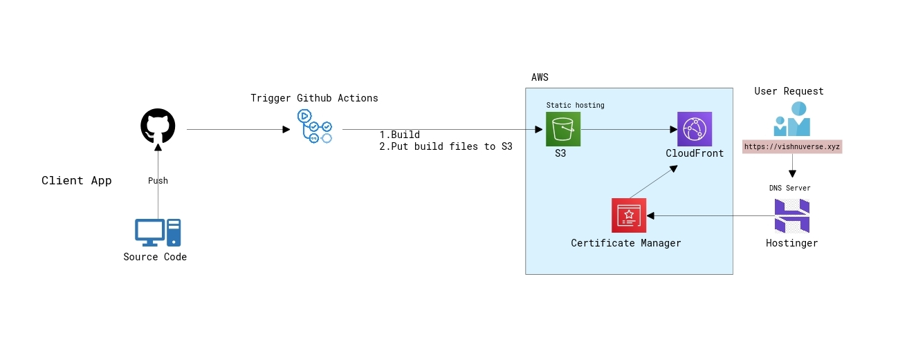

# [Cloud Resume Challenge](https://cloudresumechallenge.dev/docs/the-challenge/aws/)

This is my single-page portfolio website created using react app as part of the cloud resume challenge by [Forrest Brazeal](https://forrestbrazeal.com/).

# API Infrastructure repo:

### https://github.com/vishnumohanan404/crc-api

### Goal

The primary purpose of the front-end app is to demonstrate my cloud and devops skills while showcasing projects, skills, and experiences. The portfolio website has a visitor count functionality which is served from an API built and driven using various AWS services. This project also utilizes Terraform and Github Actions for CI/CD and Infra Provisioning.

### Deployment and Infrastructure

The front-end app leverages several AWS services for deployment and content delivery:

1. S3 Static Site Hosting: The built React app is uploaded to an S3 bucket configured for static website hosting. This makes the website publicly accessible through a unique S3 endpoint URL.
2. CloudFront (CDN): A CloudFront distribution sits in front of the S3 bucket, acting as a content delivery network (CDN). CloudFront caches static content across geographically distributed edge locations, delivering content to users with minimal latency. This improves website loading speed and performance for global visitors.
3. Hostinger (DNS): Hostinger manages the Domain Name System (DNS) configuration for vishnuverse.xyz. It directs web traffic to the CloudFront distribution associated with the S3 bucket.
4. AWS Certificate Manager (HTTPS): An SSL/TLS certificate from AWS Certificate Manager enables HTTPS for secure communication between users' browsers and the website hosted on S3.

### Architecture

## CI/CD Workflow

A CI/CD pipeline automates the process of building, testing, and deploying the front-end application. Here's a simplified overview of the workflow using GitHub Actions:

- The workflow is triggered when there's a push to the main branch of the Git repository.
- The workflow retrieves the code from the repository and install the dependencies
- AWS credentials are securely configured for interacting with S3 and CloudFront.
- The React app is built for production using a command like `npm run build `
- The built files from the `dist` directory are synchronized to the S3 bucket configured for static website hosting.
- Finally, an invalidation request is sent to CloudFront to discard any cached content associated with the website. This ensures users always receive the latest website version.

### Future Scopes

- Infrastructure as Code (IaC): Terraform to manage infrastructure provisioning as code.
- Improved CI/CD with Unit Testing: Integrate unit testing frameworks like Jest into the CI/CD pipeline
- Advanced CI/CD Practices: Consider incorporating additional CI/CD practices like code linters and static code analysis tools like SonarQube
